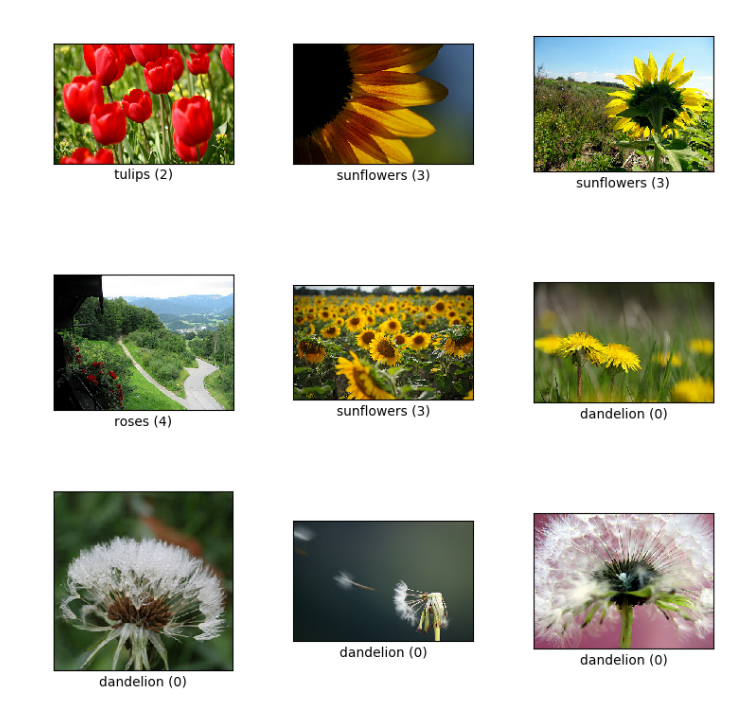

# Flowers-Recognition Using Machine Learning

### Identify What species of flower is in the picture?

#### Database:
I used flowers-recognition database, this database contains only images of flowers and divides them into five types of flowers: daisy, dandelion, rose, sunflower, tulip. (Total – 4326)
 
[link to DB](https://www.kaggle.com/alxmamaev/flowers-recognition).

To solve the problem I used a number of different models: **SVM**, **Random Forest**, **Neural Network** and **CNN**.

#### Results:
For details of all model results: 
[link to report](report.pdf)
